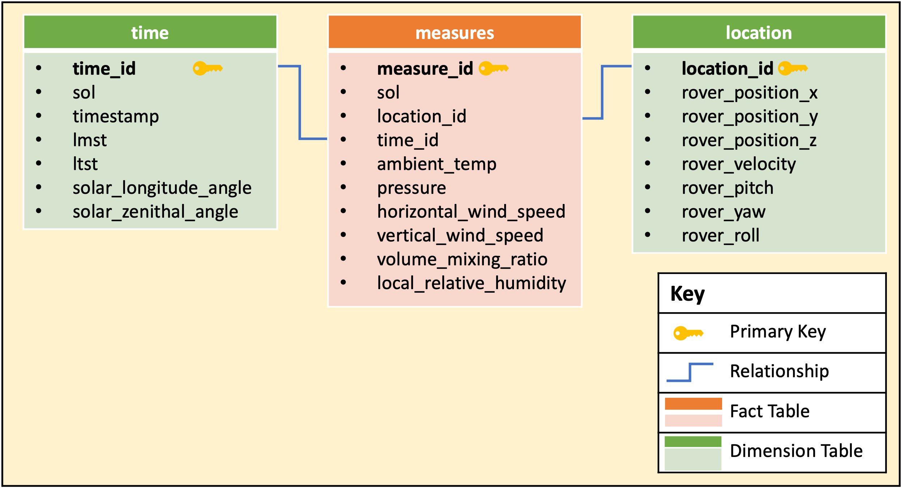
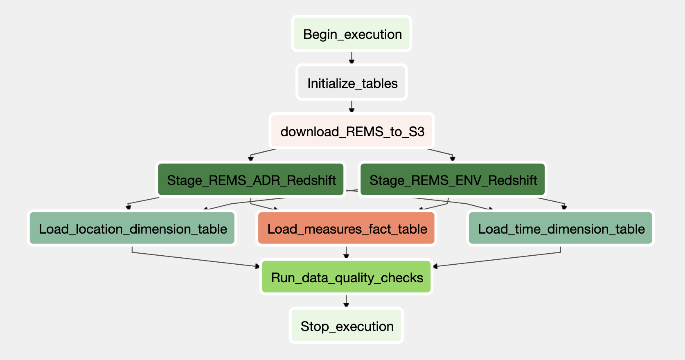

# Mars Curiosity Redshift Data Warehouse & Airflow Pipeline
Udacity Data Engineering Capstone Project

## Project Summary
The goal of this project is to provide an SQL-queryable data warehouse for analysts to analyze data collected from the Mars Curiosity Rover. To this end, the project combines multiple data sets on environmental observations and rover telemetry to organise it into an Amazon Redshift data warehouse via an Apache Airflow managed data pipeline. As part of this work, the data will be uploaded to S3 after which the data will be read from S3, then loaded into staging tables in Redshift before the creation of fact and dimension tables. In the final step, data quality checks are performed on the output tables to verify the health of the pipeline output. 

## Background
The Mars Curiosity Rover was launched on November 26, 2011 and continues to conduct experiments and collect data on the Martian surface. August 6, 2021 marked the rovers nineth year of operations covering over 3,000 days.

[Source: NASA. Mars Curiosity Rover -  Mission Timeline Summary](https://mars.nasa.gov/msl/timeline/summary/)

## Use Cases
This data product may be applied to a range of use cases including:
* Deepening our understanding of Mars' seasonal conditions 
* Providing an accessible resource for the creation of a Rover-centric app delivering visualizations of monthly weather and positional data
* A post-mortem analysis of whether weather-related risks were considered in the planning of rover manouevers

## Queries
Some examples of the kind of queries that may be performed using this data product include:
* Determining the daily extreemes of temperature, pressure, and humidity observed by the rover
* Determining the average horizontal and vertical wind speeds by hour
* Calculating the average horizontal distance covered per day of the mission

## Database Model
This data product is a readshift database with staging tables (`stg_rems_env` and `stg_rems_adr`) loaded from the s3 bucket, as well as a fact table (`measures`) and dimension tables (`location` and `time`). The figure below depicts the relationships in the data model.

### Measures Fact Table
|**Table Column**   |**Data Type**   | **Description**   |
|---|---|---|
| measure_id  | VARCHAR  | generated primary key  |
|  sol |  INT |  day of the mission |
| location_id  | VARCHAR  | generated foreign key  |
| time_id  |  VARCHAR |  generated foreign key |
| ambient_temp  |  FLOAT | estimated ambient air temperature (Kelvin)  |
| pressure  | FLOAT  | Atmospheric pressure (Pascal)  |
| horizontal_wind_speed  | FLOAT  |  horizontal wind speed (meters/second) |
| vertical_wind_speed  | FLOAT  | vertical wind speed (meters/second)  |
| volume_mixing_ratio  | FLOAT  | volume mixing ratio of water vapour (ppm)  |
local_relative_humidity| FLOAT  |  local relative humidity at humidity sensor (%) |   

### Time Dimension Table
|**Table Column**   |**Data Type**   | **Description**   |
|---|---|---|
| time_id  | VARCHAR  | generated primary key  |
|  sol | INT  | day of the mission  |
| timestamp  | BIGINT  | number of seconds since noon 1-Jan-2000 (seconds) |
| lmst  |  VARCHAR |  Local Mean Solar Time. It is in the format
                           SSSSSMHH:MM:SS.sss where:
                           SS  - Sol number (00000-99999)
                           M   - sol/time separator
                           HH  - hour (0-23)
                           MM  - minute (0-59)
                           SS  - second (0-59)
                           sss - fractions of second (000-999) |
| ltst  | VARCHAR  |  Local True Solar Time with respect to the 
                           rover position. It is in the format 
                           SSSSS HH:MM:SS.sss where:
                           SS  - Sol number (00000-99999)
                           HH  - hour (0-23)
                           MM  - minute (0-59)
                           SS  - second (0-59) |
| solar_longitude_angle  |  FLOAT | Solar azimuth angle relative to REMS rover
                           frame (degrees)  |
| solar_zenithal_angle  |  FLOAT |  Solar elevation angle relative to REMS rover frame (degrees)  |

### Location Dimension Table
|**Table Column**   |**Data Type**   | **Description**   |
|---|---|---|
| location_id  |  VARCHAR | generated primary key  |
| rover_position_x  | FLOAT  |  x-component of the rover's position relative to landing site where +X is along the local north direction (meters) |
| rover_position_y  | FLOAT  |  y-component of the rover's position
                           relative to landing site where +Y is along the local east direction (meters) |
| rover_position_z  | FLOAT  |  z-component of the rover's position relative to landing site where +Z is an increase in elevation (meters) |
| rover_velocity  | FLOAT  |  rover velocity in meters/hour |
| rover_pitch  |  FLOAT | counterclockwise rotation angle about the Y-axis   |
| rover_yaw  |  FLOAT | counterclockwise rotation angle about the Z-axis  |
| rover_roll |  FLOAT | counterclockwise rotation angle about the X-axis  |   

## Datasets Used
There are 2 main datasets used from NASA's Planertary Data System on the Mars Curiosity Rover Environment Monitoring Station (REMS) found [here](https://atmos.nmsu.edu/PDS/data/mslrem_1001/):
* **REMS Environment data set**: This data set
* **REMS Ancillary data set**:

## Airflow DAG Overview
An overview of the ETL pipeline is provided in the Directed Acyclic Graph (DAG) below:

## References

- [Jet Propulsion Laboratory. Mars Science Laboratory (MSL) Software Interface Specification (SIS) Rover Environmental Monitoring Station (REMS) Experiment Data Record (EDR). Jan 31, 2013.](https://atmos.nmsu.edu/PDS/data/mslrem_0001/DOCUMENT/MSL_REMS_EDR_SIS.PDF)  
- [Jet Propulsion Laboratory. Mars Science Laboratory (MSL) Fact Sheet. Nov 17, 2014.](https://mars.nasa.gov/system/internal_resources/details/original/605_MSL_Fact_Sheet.pdf) 
- [The Open University. OpenMars Ozone Column Database. February 2019](https://ordo.open.ac.uk/articles/dataset/OpenMARS_ozone_column_database/7315430)
- [Baum, Mark. REMS Data Downloader. Accessed December 4, 2021.](https://github.com/markmbaum/REMS)
- [Programmatic Ponderings. DevOps for DataOps: Building a CI/CD Pipeline for Apache Airflow DAGs](https://programmaticponderings.com/tag/apache-airflow/)

